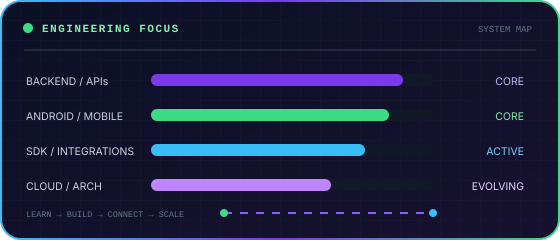

<div align="center">
  <picture>
    <source media="(prefers-color-scheme: dark)" srcset="./assets/mateus-banner.svg" />
    <source media="(prefers-color-scheme: light)" srcset="./assets/mateus-banner-light.svg" />
    
  </picture>

  <br />

  <a href="https://mateustechservices.vercel.app/"></a>
  <a href="https://www.linkedin.com/in/mateus-de-souza-devjava/"></a>
</div>

<br />

<p align="center">
  
</p>

<p align="center">
  <em>“Software confiável começa com decisões claras. Do dispositivo à API, cada conexão importa.”</em>
</p>

<br />

<h3 align="center">🧬 Sobre mim</h3>

<p align="center">
  Desenvolvedor focado no ecossistema <strong>Java</strong>, atuando entre <strong>Backend e Mobile</strong>.<br />
  Construo APIs, integrações e aplicações Android com atenção a arquitetura, segurança e experiência de uso.
</p>

Atualmente, aprofundo meus conhecimentos em **Cloud, AWS, Arquitetura de Software e Sistemas Distribuídos**, conectando estudo e prática em projetos reais.

```java
public final class MateusSouza {

    private final String role = "Java • Backend • Android Developer";

    private final String[] coreStack = {
        "Java", "Kotlin", "Spring Boot", "Android", "Firebase"
    };

    private final String[] building = {
        "APIs REST", "Aplicações Android", "SDKs e integrações",
        "Soluções com IA", "Arquitetura de software"
    };

    public String mission() {
        return "Transformar problemas reais em software confiável.";
    }
}
```

<br />

<h3 align="center">🧰 Stack & Engineering Snapshot</h3>

<p align="center">
  <picture>
    <source media="(prefers-color-scheme: dark)" srcset="./assets/mateus-stats.svg" />
    <source media="(prefers-color-scheme: light)" srcset="./assets/mateus-stats-light.svg" />
    
  </picture>
  <picture>
    <source media="(prefers-color-scheme: dark)" srcset="./assets/mateus-focus.svg" />
    <source media="(prefers-color-scheme: light)" srcset="./assets/mateus-focus-light.svg" />
    
  </picture>
</p>

<p align="center">
  
  
  
  
  
</p>

<details>
  <summary><strong>Ver stack completa</strong></summary>

- **Backend & APIs:** Java, Spring Boot, Spring Security, Maven, REST, JWT e Swagger/OpenAPI.
- **Mobile:** Kotlin, Java, Android, Gradle, Firebase Cloud Messaging e Firestore.
- **Dados:** MySQL, PostgreSQL e modelagem SQL.
- **Ferramentas:** Git, GitHub, Docker, Postman, IntelliJ IDEA e VS Code.
- **Em evolução:** AWS, Cloud, microsserviços, arquitetura de software e sistemas distribuídos.

</details>

<br />

<h3 align="center">🚀 Projetos em destaque</h3>

| Projeto | Tecnologias & entrega |
| :--- | :--- |
| [💊 **Controle de Fármacos**](https://github.com/MateusSouzaAlves/rest-spring-boot-controle-farmacos) | `Java` `Spring Boot` `JWT` `MySQL` `Flyway`<br />API hospitalar com autenticação, estoque e documentação Swagger. |
| [📲 **Firebase Notification**](https://github.com/MateusSouzaAlves/Firebase-Notification) | `Android` `Java` `FCM` `Firestore`<br />Aplicação mobile com notificações, persistência e autenticação. |
| [🧩 **Projeto Yuri**](https://github.com/MateusSouzaAlves/Projeto-Yuri) | `Java` `Jakarta EE` `JDBC` `MVC`<br />Aplicação web com login, produtos, avaliações e persistência MySQL. |
| [🏛️ **SOLID with Java**](https://github.com/MateusSouzaAlves/SolidWithJava) | `Java` `SOLID` `OO` `Arquitetura`<br />Exemplos práticos dos cinco princípios SOLID. |

> 💡 *Backend forte, mobile conectado e arquitetura pensada para evoluir.*

<br />

<h3 align="center">📊 GitHub Stats & Graphs</h3>

<p align="center">
  <picture>
    <source media="(prefers-color-scheme: dark)" srcset="https://github-readme-activity-graph.vercel.app/graph?username=MateusSouzaAlves&amp;bg_color=0B1026&amp;color=C4B5FD&amp;line=7C3AED&amp;point=3DDC84&amp;area=true&amp;area_color=4C1D95&amp;hide_border=true&amp;custom_title=Contribution%20Graph" />
    <source media="(prefers-color-scheme: light)" srcset="https://github-readme-activity-graph.vercel.app/graph?username=MateusSouzaAlves&amp;bg_color=F8FAFC&amp;color=4C1D95&amp;line=7C3AED&amp;point=15803D&amp;area=true&amp;area_color=DDD6FE&amp;hide_border=true&amp;custom_title=Contribution%20Graph" />
    
  </picture>
</p>

<p align="center"><sub>O snapshot visual representa o perfil público observado em agosto de 2026; o gráfico de atividade é atualizado pelo serviço externo.</sub></p>

<br />

<h3 align="center">🐍 Contribution Snake</h3>

<p align="center">
  <picture>
    <source media="(prefers-color-scheme: dark)" srcset="https://raw.githubusercontent.com/MateusSouzaAlves/MateusSouzaAlves/output/github-snake-dark.svg" />
    <source media="(prefers-color-scheme: light)" srcset="https://raw.githubusercontent.com/MateusSouzaAlves/MateusSouzaAlves/output/github-snake.svg" />
    
  </picture>
</p>

<br />

<h3 align="center">📫 Vamos conversar?</h3>

<p align="center">
  Se você quer conversar sobre <strong>Java, Android, APIs, integrações ou arquitetura</strong>, estes são os melhores canais:
</p>

<p align="center">
  <a href="mailto:mateus_amoavida_2@hotmail.com"></a>
  <a href="https://www.linkedin.com/in/mateus-de-souza-devjava/"></a>
  <a href="https://www.youtube.com/@MateusOProgramador"></a>
</p>

<p align="center">
  
</p>

<p align="center">
  <strong>Construindo experiências Android conectadas a backends Java confiáveis.</strong><br />
  <sub>Always learning. Always building. Always connecting systems.</sub>
</p>
